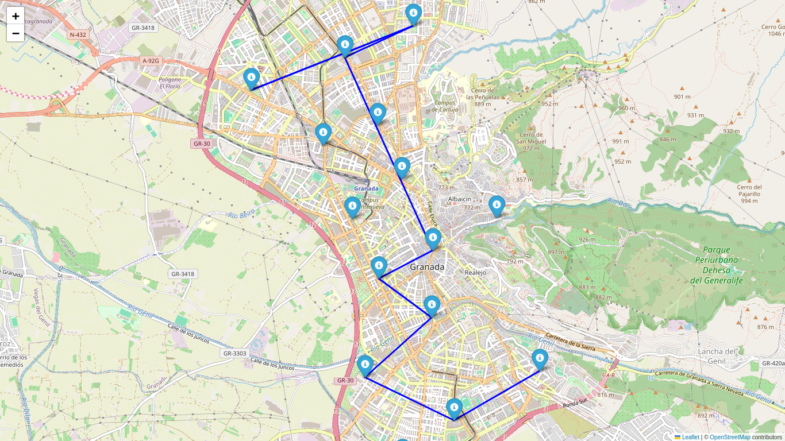
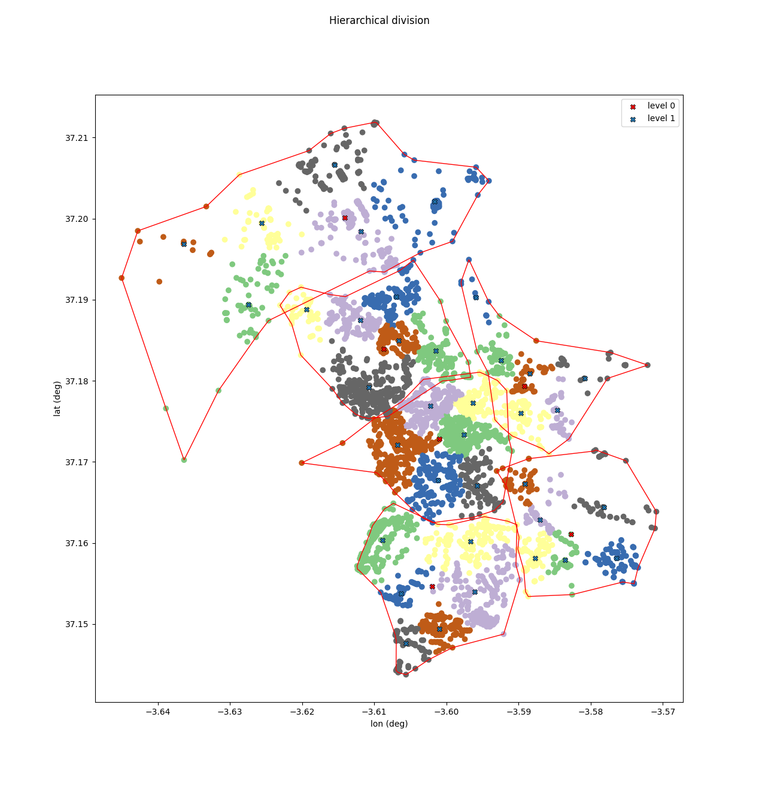

<h1 align="center"> Connected Cities </h1>
<h3 align="center">  City Planning in the Quantum Era</h3>
<h4 align="center"> Pasqal Challenge </h4>




<div>
<font size="4">
<emph><strong>Authors</strong></emph>: Víctor Bayona Marchal, Jose Manuel Montes Armenteros, Yllari González Koda and Brian Sena Simons
</font>
</div>


# Table of contents
1. [Pasqal Challenge](#pasqal-Challenge)
   1. [Introduction](#introduction)
   2. [QUBO problem: iteration 1](#qubo-problem-iteration-1)
       1. [Conditions](#conditions-iteration-1)
   3. [QUBO problem: iteration 2](#qubo-problem-iteration-2)
       1. [Conditions](#conditions-iteration-2)
   4. [Optimizations of weights](#optimization-of-weights)
   5. [Multi-route implementation](#multi-route-implementation)
2. [Setup and Requirements](#setup-and-requirements)
    1. [Structure](#structure)
    2. [Requirements](#setup)
        1. [Linux](#linux)
        2. [Windows](#windows)
    3. [How-to](#how-to)
        1. [Visualize hierarchical cluster](#visualize-the-hierarchical-clustering-algorithm)
        2. [Download amenities from a city](#download-amenities-from-a-city)

# Pasqal Challenge

## Introduction
We aim to solve the problem of creating M bus lines, each with P bus stops in a city with a total number of N stops. We consider the following:

1. Distances are not symmetric (in general, $d(A,B) \neq d(B,A)$).
2. Bus stops are set based on social and demographic factors.
3. The number of bus stops per line, as well as the number of lines, are hyperparameters of the problem.

As the distances between stops are not symmetric, we can define the binary variables as

```math
    x_{ij}^{l} \in \{0,1\}
```

Where the value is 1 only if the line $l$ goes at some point from stop $i$ to stop $j$. The global function that we want to minimize is

```math
    f(x_{00}^{0}, x_{01}^{0},...,x_{0N-1}^{0}, x_{10}^{0}, ..., x_{N-1N-1}^{0}, x_{00}^{1}, ..., x_{N-1N-1}^{L-1}) = \sum_{l}^{L-1}\sum_{i}^{N-1}\sum_{j}^{N-1}D_{ij}x_{ij}^{l}
```

where the matrix of distances $D_{ij}$ is not symmetric and of order $N\times N$. The formulation of the optimization problem is based on the QUBO problem, i.e, minimizing

```math
F_Q(z) = z^TQz
```

where $z$ is a n-dimensional column vector and $Q$ an $n\times n$ matrix. To translate the problem to a QUBO formulation, we need some conditions and the binary variables.

## QUBO problem: iteration 1

The objective is to find a valid bus route for a single bus line with an initial stop (stop 0) and a final stop (stop N-1). A further simplification is to consider symmetric distances ($D_{ij}^{'} = D_{ij} + D_{ji} \quad \text{for} \; i<j, \quad 0 \quad \text{otherwise}$). The relevant binary variables are then reduced to $R=N(N-1)/2$. We express them in the binary vector of $R$ components $y$, with the correspondence $\{i,j\}\rightarrow k$ given by

```math
     \{i,j\} \rightarrow k = S_{i}+(j-i-1) = \sum_{m=0}^{i-1}(N-1-m)+(j-i-1)
```
```math
     k \rightarrow \{i,j\} \quad\text{such that} \quad S_{i}\leq k < S_{i+1} \quad \text{and} \quad j = i+1+k-S_i
```

With that, we only need the following conditions.

### Conditions: iteration 1
Every condition is weighted according to its importance.

1. Every bus route has a lenght of $p+1$ stops (or $p$ connections): $\sum_{k=0}^{R-1} y_{k} = p $.
2. Every bus stop which is not the start or the end of the route should have 0 or 2 connections: $d_{i} = \sum_{j<i} y_{\{j,i\}} + \sum_{k=i+1}^{N-1}y_{\{i,k\}} \in \{0,2\} \quad \forall i\in\{1,...,N-2\}$.
3. The first stop (0) should have only one connection: $\sum_{j=1}^{N-1} y_{\{0,j\}} = 1$.
4. The last stop (N-1) should have only one connection: $\sum_{i=0}^{N} y_{\{i,N-2\}} = 1$.

With these conditions and appropiate weights, we should be able to generate a valid bus route. The conditions are also produced in a way that the final Q matrix is symmetric as needed by the geometrical embeding.


## QUBO problem: iteration 2

Using the formulation of the Traveling Salesman Problem, one line of a bus is implemented. An initial stop (i) and final stop (j) are selected, allowing for i=j and not necessarily being i=0, j=N-1. The route has p+1 stops. The distances remain asymmetric (but the routes can be understood to be bidirectional). The variables are now a total of $R=N(p+1)$ and are of the shape $(y_{0N+0}, ..., y_{0N+N-1}, y_{1N+0},...,y_{1N+N-1},... ,..., y_{pN+N-1})$. The encoding is now thought to be about time-steps. More information [here](https://github.com/microsoft/qio-samples/blob/danielstocker-slc-ship-loading/samples/traveling-salesperson/traveling-salesperson.ipynb).  In the proper Traveling Salesman formulation, the only difference is that $p=N$

The cost function is then

```math
    \sum_{k=0}^{p-1}\sum_{i=0}^{N-1}\sum_{j=0}^{N-1} (x_{Nk+i}\cdot x_{N(k+1)+j}D_{ij})
```

The cost function in the $Q_matrix$ representation is just inserting the distances cost matrix $D$ into blocks $0;1$, $1;2$,...,$N-2;N-1$. For symmetric purposes, the cost $Q_matrix^{T}$ is also added.

### Conditions: iteration 2

Every condition has a weight which is aimed to be optimized.

1. In each step the bus is in only one stop: $\sum_{k=0}^{p}\sum_{i=0}^{N-1}\sum_{j=0}^{N-1}(x_{i+Nk}x_{j+Nk})=0$ (In the reference this term is not symmetric as it takes only $i<j$. Here we consider the rest of the terms, which only adds more weight to the penalty).
2. In each step, the bus should be somewhere: $(\sum_{k}^{N(p+1)-1}x_{k}-(p+1))^2$
3. Just one visit to each node: $\sum_{k}^{N(p+1)-1}\sum_{f=k+N,step \;N}^{Np-1}x_{k}x_{f}=0$
4. Start node is negatively penalized: $-\lambda_4 x_{0+i}$
5. End node is negatively penalized: $-\lambda_5 x_{Np+j}$

### Optimization of weights

Some strategies for choosing the most suitable lambda parameters are followed. The first one is to fix all penalties to the maximum distance in the distances matrix.

### Multi-route implementation

An approach for finding new routes for the same stops which connect all the stops could be to select the new start and end nodes as well as eliminate the previous formed line's start and end nodes. Therefore, we allow for crossing lines but without starting or ending in the same nodes.

# Setup and Requirements
## Structure
```bash
├── data
│   ├── amenities-granada.csv
│   ├── overpy-granada-query.txt
│   └── utils.py
├── docs
│   └── pasqal.pdf
├── main
│   ├── tree
│   │   ├── linkageTree.py
│   │   └── utils.py
│   ├── tsp
│   │   └── TSP_Formulation_Methods.py
│   └── vqaa
│       └── vqaa_tools.py
├── POC.ipynb
├── README.md
├── requirements.txt
└── results
```
Regarding the directories, they are organized as follows:
- `docs`: Contains documentation about the project development and formulation.
- `data`: Contains the main python scripts that are related to data fetching and preprocessing.
- `main`: Contains the main python scripts to run the experiments.
    - `tree`: Contains the hierarchical clustering algorithm, `linkageTree` and visualization techniques `utils`.
    - `tsp`: Contains the adaptation of the travelman sales problem for bus line optimization.
    - `vqaa`: Contains the algorithms related to the quantum algorithm.
- `results`: Contains the result of the experiments.

Regarding the notebooks we have:
- `POC.ipynb`: Jupyter Notebook with the minimal working example for iteractive visualization of the proposed project.


## Requirements
In order to run all the experiments make sure to install all the necessary libraries.
We recommend creating an environment to avoid incompatibility with other already installed python libraries in your system.
### Linux
```python
python -m venv .venv
source .venv/bin/activate
python -m pip install -r requirements.txt
```
### Windows
```python
python -m venv .venv
.\venv\Scripts\activate.bat
python -m pip install -r requirements.txt
```
## How-to
### Visualize the hierarchical clustering algorithm.
We can simply run the algorithm in the main package as follows
```python
python -m main.tree.linkageTree -data data/amenities-granada.csv
```
Remember to pass a valid csv with the format similar to `overpy` library.
The output should be an image similar to the following:



### Download amenities from a city.We can simply run the algorithm in the data package as follows
```python
python -m main.data.utils -output data/amenities-granada.csv -query data/overpy-granada-query.txt
```
We are using the `overpy` library to fetch the data. Therefore, the query file should follow overpy valid structure.
